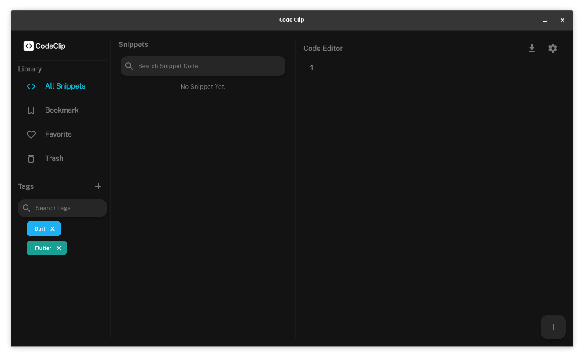
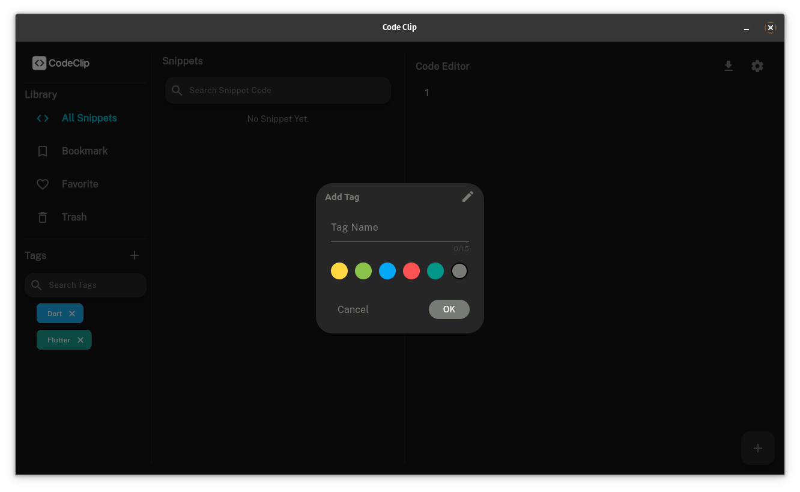
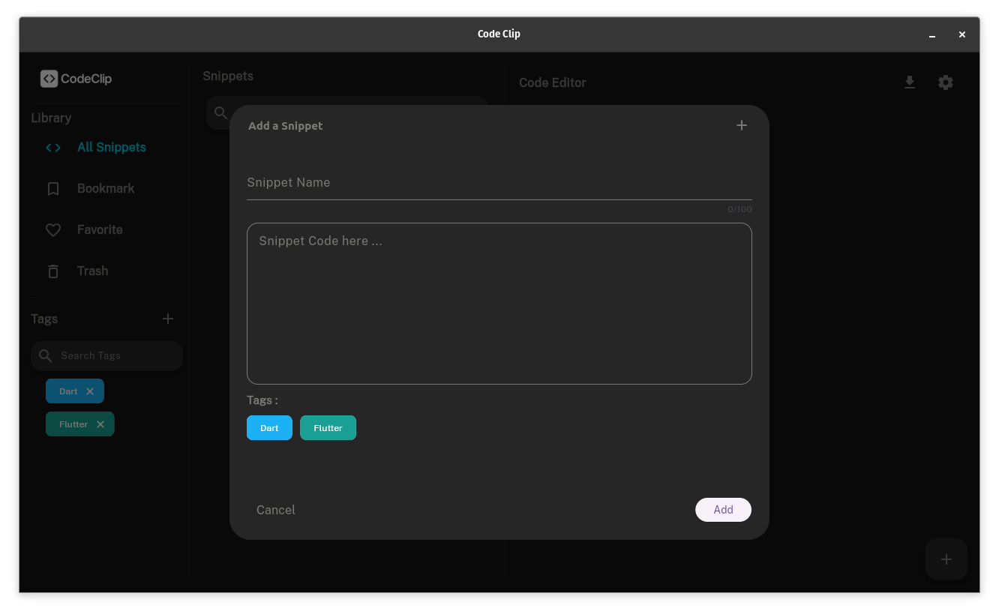
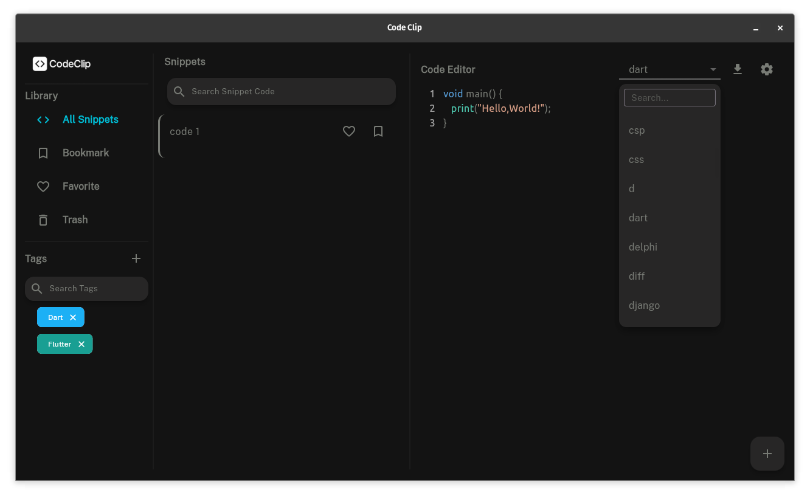

# Snippet Code 💡

A modern cross-platform snippet manager built with Flutter.  
Supports Linux for now, featuring a sleek UI and offline storage.

## 🖥️ Platforms
- ✅ Linux (.deb)

## 🚀 Installation
### Linux
Download the `.deb` file from [Releases](https://github.com/hoseda/CodeClip/releases):
```bash
sudo dpkg -i snippet_code.deb
```

# 📸 ScreenShots

-  ## 🏠 HomePage
  

-  ## 󠀧🏷️ Add Tag
  

-  ## ✂️ Add Snippet
  

-  ## 🌈 Update Code Theme
  
